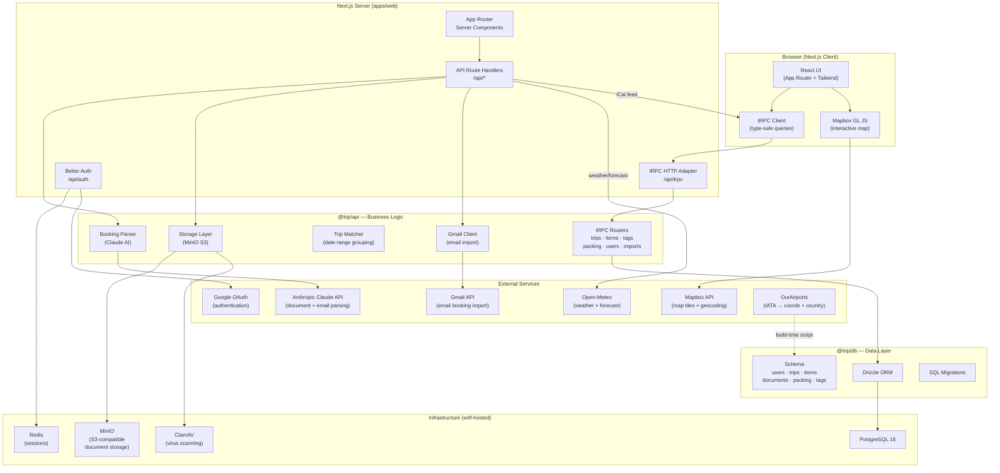
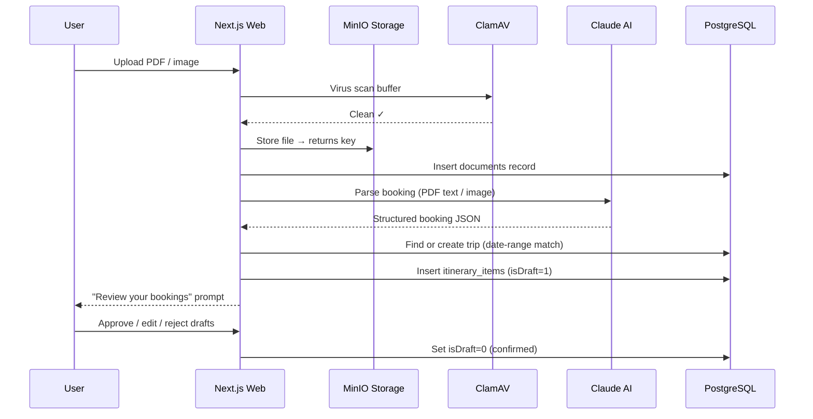
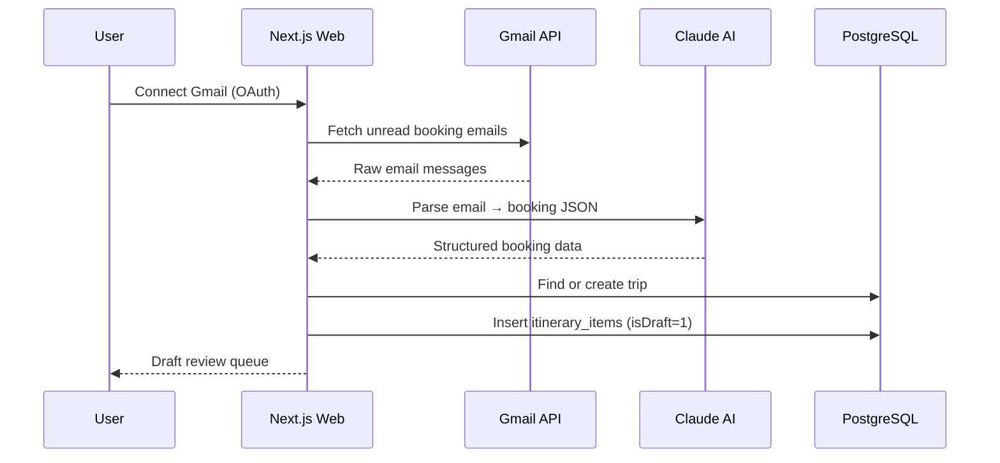
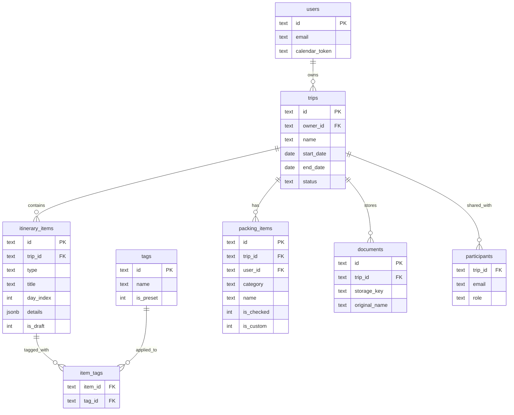

# Architecture Overview — My Trip Planner

## Tech Stack at a Glance

| Layer | Technology |
|---|---|
| Monorepo | Turborepo + pnpm workspaces |
| Frontend | Next.js 15 (App Router), React 19, TypeScript, Tailwind CSS |
| API | tRPC v11 (end-to-end type-safe) |
| Database | PostgreSQL 16 + Drizzle ORM |
| Auth | Better Auth (Google OAuth) |
| Storage | MinIO (S3-compatible, self-hosted) |
| AI | Anthropic Claude (document + email parsing) |
| Maps | Mapbox GL JS |
| Weather | Open-Meteo (free, no key required) |
| Email Import | Gmail API |
| Virus Scan | ClamAV |
| Cache / Session | Redis |

---

## Repository Structure

```
tripit/                          ← Turborepo root
├── apps/
│   └── web/                     ← Next.js 15 application
│       ├── src/
│       │   ├── app/             ← App Router pages & API routes
│       │   │   ├── (app)/       ← Authenticated layout group
│       │   │   │   ├── trips/   ← Trip list + per-trip tabs
│       │   │   │   ├── search/  ← Global item search
│       │   │   │   ├── stats/   ← Travel statistics
│       │   │   │   ├── import/  ← Gmail import UI
│       │   │   │   └── settings/← Calendar URL + preferences
│       │   │   ├── (auth)/      ← Login page
│       │   │   └── api/         ← Next.js route handlers
│       │   │       ├── trpc/    ← tRPC HTTP adapter
│       │   │       ├── auth/    ← Better Auth handler
│       │   │       ├── upload/  ← Document upload endpoint
│       │   │       ├── calendar/← Public iCal feed
│       │   │       ├── stats/   ← Travel stats endpoint
│       │   │       └── trips/[tripId]/
│       │   │           ├── weather/  ← Historical weather
│       │   │           └── forecast/ ← 10-day forecast
│       │   ├── components/      ← Shared React components
│       │   └── lib/             ← Client utilities + airports data
│       └── public/
│
├── packages/
│   ├── api/                     ← tRPC router + business logic
│   │   └── src/
│   │       ├── routers/         ← trips, itinerary-items, tags,
│   │       │                       packing-list, users, imports, documents
│   │       └── lib/             ← booking-parser, trip-matcher,
│   │                               booking-to-items, storage, gmail
│   ├── db/                      ← Drizzle ORM schema + migrations
│   │   └── src/
│   │       ├── schema/          ← users, trips, itinerary-items,
│   │       │                       documents, packing-items, tags
│   │       └── migrations/      ← SQL migration files
│   └── shared/                  ← Zod schemas + TypeScript types
│                                   shared between app and API
│
└── scripts/
    └── generate-airports.mjs    ← Regenerates airports.ts from OurAirports
```

---

## System Architecture Diagram



---

## Data Flow: Document Import



---

## Data Flow: Gmail Email Import



---

## Database Schema (simplified)



---

## Key Design Decisions

### tRPC for API
All client↔server communication (except file uploads and iCal) goes through tRPC. This gives full TypeScript type safety from database query to React component — no manual type definitions, no API contract drift.

### Drizzle ORM
Drizzle generates SQL from TypeScript schema definitions and provides type-safe query builders. Migrations are plain SQL files, making them easy to review and version-control. The `schema` object is passed to the Drizzle client, enabling the relational query API (`db.query.trips.findFirst()`).

### AI-Powered Parsing (Claude)
PDFs and forwarded emails are sent to Claude with a structured prompt that extracts booking data (flight numbers, hotel names, dates, confirmation codes) into a validated JSON schema. The parsed output is always put through a human review step (draft queue) before being committed to the itinerary.

### File Storage (MinIO)
Documents are stored in MinIO (an S3-compatible object store). In production this can be swapped for AWS S3 or Cloudflare R2 with a single endpoint change. All files pass through ClamAV antivirus scanning before being stored.

### Airport Data (Build-Time)
`AIRPORT_COORDS`, `AIRPORT_CITIES`, `AIRPORT_COUNTRIES`, and `COUNTRY_NAMES` are generated at build time from the OurAirports public-domain CSV dataset via `scripts/generate-airports.mjs`. This produces a static TypeScript file (~4,500 airports, 236 countries) that ships with the client bundle — no runtime API calls needed for airport lookups.

### iCal Calendar Feed
Each user has a private, token-authenticated URL (`/api/calendar/[token]`) that returns a standards-compliant iCal (RFC 5545) feed. The feed can be subscribed to in Google Calendar, Apple Calendar, or Outlook. The token can be reset from Settings to invalidate old URLs.

### Packing Lists
Packing lists are generated server-side using a rule-based algorithm that takes into account trip duration, climate (inferred from destination latitude + month), booking types (flights, hotels, car rentals), and activity keywords. Each traveler has their own list per trip. Custom items are preserved across regeneration.

---

## Local Development Services

| Service | Port | Purpose |
|---|---|---|
| Next.js | 3000 | Web application |
| PostgreSQL | 5432 | Primary database |
| Redis | 6379 | Session store |
| MinIO | 9000 | Object storage (S3-compatible) |
| MinIO Console | 9001 | Storage admin UI |
| ClamAV | 3310 | Antivirus scanning |
